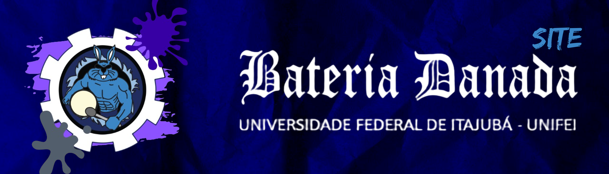

<h1 align="center">Bateria Danada Unifei</h1>

<p align="center">
  Página desenvolvida como projeto final da capacitação técnica do processo trainee da <a href="https://byronsolutions.com/">byron.solutions</a>.
</p>

<p align="center">
  <a href="#-tecnologias">Tecnologias</a>&nbsp;&nbsp;&nbsp;|&nbsp;&nbsp;&nbsp;
  <a href="#-projeto">Projeto</a>&nbsp;&nbsp;&nbsp;|&nbsp;&nbsp;&nbsp;
  <a href="#-download">Download</a>

</p>



<br>

## 🚀 Tecnologias

Esse projeto foi desenvolvido com as seguintes tecnologias:

- [ReactJs](https://react.dev/)
- [TailwindCSS](https://tailwindcss.com/)
- [NextJs](https://nextjs.org/)
- [Git](https://git-scm.com/) e [GitHub](https://github.com/)

<br>

## 💻 Projeto

Este projeto foi desenvolvido com o objetivo de divulgar e aumentar o reconhecimento e valor da bateria universitária da Universidade Federal de Itajubá, a <font bold color="blue"> **Bateria Danada Unifei**</font>, apresentando as divisões e vertentes que compõem o projeto, além de disponibilizar um meio de contato direto com o projeto para a sua contratação em eventos.

<br>


<br>

## ⬇️ Download

```bash

   # Entrar no diretório desejado, exemplo:
   $ cd C:/projetos/bateria-danada

   # Clonar o repositório
   $ git clone https://github.com/Tsplay25/bateria-danada

   # Instalar as dependências
   $ npm install

   # Executar o projeto
   $ npm run dev

```

<br>

> É necessário ter o <a href="https://nodejs.org/en">Node.js</a> instalado na sua máquina!

<br>

---

<p align="center">Projeto realizado com 💙 por <a href="https://github.com/edusiles">Eduardo Siles</a> 💪 e <a href="https://github.com/Tsplay25">Talles Alves</a> 🦘</p>
